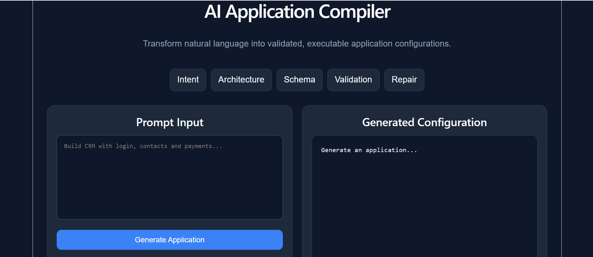
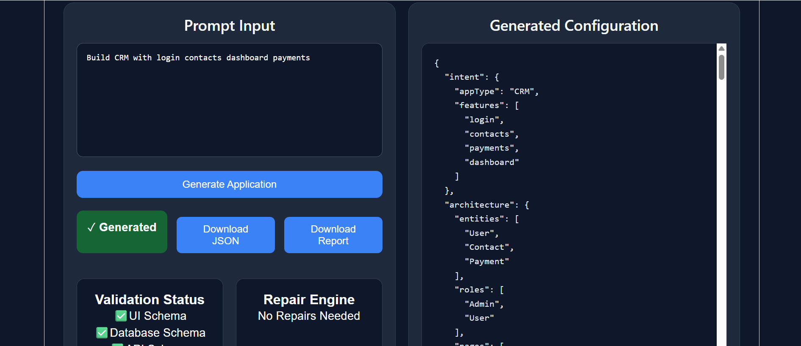
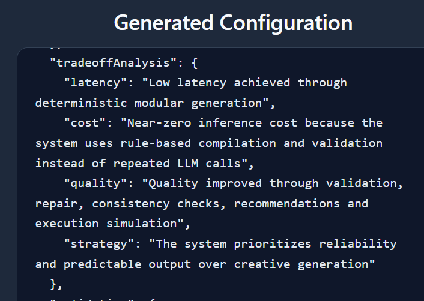

<<<<<<< HEAD
## Screenshots

### Home Page



### Generated Output



### Tradeoff Analysis


=======
# AI App Compiler

AI App Compiler is a deterministic full-stack application generation system that transforms natural language requirements into executable software blueprints. Instead of repeatedly relying on large language model inference, the system uses modular compilation, validation, repair, and execution-awareness pipelines to generate reliable and predictable outputs.

---

## Overview

The compiler accepts a user requirement and automatically generates:

- Application Architecture
- Frontend Structure
- Backend Structure
- Database Schema
- API Specifications
- Authentication Design
- Runtime Execution Plan
- Validation Reports
- Repair Suggestions
- Tradeoff Analysis
- Confidence Metrics
- Recommendations
- Execution Readiness Report

The goal is to bridge the gap between software requirements and implementation by producing consistent, validated, and execution-aware outputs.

---

## Features

### Intent Extraction
Extracts key application requirements from natural language input.

### Architecture Generation
Creates a complete system architecture including frontend, backend, and database components.

### UI Generation
Produces frontend structure and page recommendations.

### API Generation
Generates REST API specifications and endpoint structures.

### Database Design
Creates MongoDB collections and schema definitions.

### Authentication Planning
Generates authentication and authorization strategies.

### Validation Engine
Validates generated outputs for consistency and correctness.

### Repair Engine
Automatically detects and repairs inconsistencies.

### Runtime Planning
Generates an executable runtime plan.

### Tradeoff Analysis
Analyzes:

- Cost
- Quality
- Performance
- Reliability
- Scalability

### Execution Awareness
Determines whether the generated application blueprint is implementation-ready.

---

## System Architecture

```text
User Requirement
        │
        ▼
Intent Extraction
        │
        ▼
Architecture Generator
        │
 ┌──────┼──────┐
 ▼      ▼      ▼
UI     API    DB
Generator Generator Generator
 │       │       │
 └───Validation──┘
         │
         ▼
    Repair Engine
         │
         ▼
 Runtime Planning
         │
         ▼
 Tradeoff Analysis
         │
         ▼
 Execution Report
```

---

## Technology Stack

### Frontend

- React
- Vite
- CSS

### Backend

- Node.js
- Express.js

### Database

- MongoDB

### Development Tools

- Git
- GitHub
- VS Code

---

## Project Structure

```text
ai-app-compiler/
│
├── frontend/
│   ├── public/
│   ├── src/
│   │   ├── components/
│   │   ├── assets/
│   │   ├── App.jsx
│   │   └── main.jsx
│   │
│   ├── package.json
│   └── vite.config.js
│
├── backend/
│   ├── src/
│   │   ├── pipeline/
│   │   │   ├── intent/
│   │   │   ├── architecture/
│   │   │   ├── schema/
│   │   │   ├── validation/
│   │   │   ├── repair/
│   │   │   ├── runtime/
│   │   │   ├── report/
│   │   │   ├── confidence/
│   │   │   ├── recommendations/
│   │   │   └── analysis/
│   │   │
│   │   ├── routes/
│   │   ├── utils/
│   │   └── server.js
│   │
│   ├── package.json
│   └── package-lock.json
│
└── README.md
```

---

## Installation

### Clone Repository

```bash
git clone https://github.com/manvitha40/ai-app-compiler.git
cd ai-app-compiler
```

---

## Backend Setup

```bash
cd backend
npm install
npm start
```

Server runs at:

```text
http://localhost:5000
```

---

## Frontend Setup

```bash
cd frontend
npm install
npm run dev
```

Application runs at:

```text
http://localhost:5173
```

---

## Example Input

```text
Build a bus booking application with user authentication,
seat selection, payment integration, booking management,
and admin dashboard.
```

---

## Example Output

### Architecture

```json
{
  "frontend": "React",
  "backend": "Node.js + Express",
  "database": "MongoDB"
}
```

### Execution Report

```json
{
  "execution": {
    "status": "SUCCESS",
    "frontend": "React configuration ready",
    "backend": "Node.js + Express configuration ready",
    "database": "MongoDB schema validated",
    "executable": true
  }
}
```

### Tradeoff Analysis

```json
{
  "latency": "Low latency achieved through deterministic modular generation",
  "cost": "Near-zero inference cost because the system uses rule-based compilation and validation instead of repeated LLM calls",
  "quality": "Quality improved through validation, repair, consistency checks, recommendations and execution simulation",
  "strategy": "The system prioritizes reliability and predictable output over creative generation"
}
```

---

## Validation Pipeline

The validation engine checks:

- API consistency
- Database correctness
- UI completeness
- Authentication integrity
- Architecture compatibility

Detected issues are forwarded to the repair engine for automatic correction.

---

## Cost–Quality Discussion

### Cost

The compiler minimizes operational expenses by avoiding repeated LLM inference during generation.

Benefits:

- Low infrastructure cost
- Fast execution
- Predictable outputs
- Reduced token consumption

### Quality

Quality is improved through:

- Validation layers
- Consistency checks
- Repair mechanisms
- Runtime planning
- Confidence scoring

### Reliability

Deterministic generation ensures repeatable and stable results for identical inputs.

---

## Execution Awareness

Execution awareness determines whether generated outputs are implementation-ready.

The system evaluates:

- Frontend readiness
- Backend readiness
- Database readiness
- Validation success
- Repair completion

Outputs include executable status reports that indicate deployment readiness.

---

## Future Enhancements

- LLM-assisted architecture generation
- Automatic React component generation
- Automatic Express route generation
- Automatic MongoDB model generation
- Downloadable project scaffolding
- Multi-page application support
- Cloud deployment integration
- CI/CD pipeline generation
- Docker configuration generation

---

## Author

**Pamalpati Sai Manvitha**

B.Tech Computer Science and Engineering  
SRM University AP

GitHub: https://github.com/manvitha40

---

## License

This project is licensed under the MIT License.

---

## Repository

https://github.com/manvitha40/ai-app-compiler
>>>>>>> 5bd15e12a3e9a0c79e94bb094783566d83bbef55
